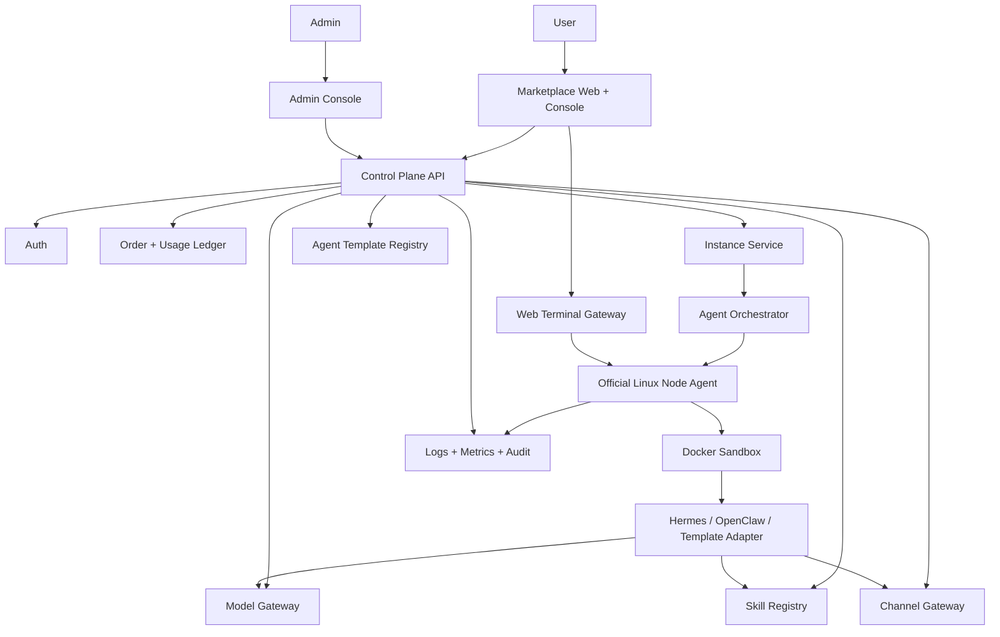

# OpenAsstAI 第一阶段架构

## 架构原则

- 第一阶段只支持官方 Linux 节点，降低信任、安全和结算复杂度。
- 用户租用的是隔离 Agent 工作空间，不是裸服务器，也不是 Provider 的个人电脑。
- Runtime、模型、通道、技能都通过适配器抽象，避免被某一个 Agent 框架绑定。
- 先完成可运行闭环，再扩展 Provider 市场、远程桌面和公开 Skill 市场。

## 系统组件

## 核心服务

### Marketplace Web + Console

面向用户的前端应用，包含市场、购买流程、实例控制台、模型配置、通道配置、技能配置、Web Terminal 和日志视图。

### Control Plane API

平台控制面，负责账号、订单、实例、模板、配置、权限、用量和审计。

### Agent Orchestrator

负责把用户的实例请求转成实际运行环境：

- 选择官方节点。
- 创建沙箱。
- 注入实例配置。
- 启动 Agent 模板。
- 执行健康检查。
- 处理停止、重启、销毁。

### Official Linux Node Agent

运行在官方节点上的常驻进程，接收控制面指令并管理本机沙箱。

职责：

- 注册节点。
- 上报 CPU、内存、磁盘、实例状态。
- 创建和销毁 Docker 容器。
- 代理 Web Terminal 连接。
- 收集日志和运行指标。

### Runtime Sandbox

第一阶段建议使用 Docker 容器。每个用户实例拥有独立容器、工作目录、环境变量、网络策略和资源限制。

后续如果需要更强隔离，可以替换为 microVM 或完整 VM。

### Model Gateway

统一管理模型配置：

- 平台提供模型 Key。
- 用户自带 API Key。
- 模型调用限额。
- Token 用量统计。
- 模型供应商适配。

### Channel Gateway

统一管理聊天通道：

- 第一阶段 Web Chat 必须可用。
- 微信、QQ、飞书、企微先做配置模型和适配器接口。
- 真实外部通道按账号、审核和平台能力逐步开放。

### Skill Registry

第一阶段只做内置技能管理：

- 技能列表。
- 安装、卸载、启用、禁用。
- 权限声明。
- 版本号。

公开 SkillHub、第三方上传、收益分成放到后续阶段。

### Web Terminal Gateway

浏览器终端入口，连接到实例沙箱。

要求：

- 用户只能连接自己的实例。
- 终端会话有过期时间。
- 操作写入审计日志。
- 支持断开重连。

## 数据模型草案

### User

- id
- email / phone / oauth identity
- role
- created_at

### AgentTemplate

- id
- name
- framework: hermes | openclaw | custom
- description
- default_model_config
- default_channel_config
- default_skills
- price_plan_ids
- status

### Instance

- id
- user_id
- template_id
- node_id
- name
- status: provisioning | running | stopped | error | destroyed
- cpu
- memory
- disk
- region
- created_at
- destroyed_at

### Node

- id
- type: official
- region
- status
- total_cpu
- total_memory
- total_disk
- available_cpu
- available_memory
- available_disk
- last_heartbeat_at

### ModelConfig

- id
- instance_id
- provider
- model
- credential_ref
- is_default

### ChannelConfig

- id
- instance_id
- type
- status
- config

### SkillInstall

- id
- instance_id
- skill_id
- version
- status
- permissions

### UsageRecord

- id
- user_id
- instance_id
- type: runtime | token | storage | network
- quantity
- unit
- price_estimate
- created_at

### AuditLog

- id
- actor_id
- instance_id
- action
- metadata
- created_at

## 推荐技术栈

第一阶段可以用熟悉、快速、易部署的组合：

- Frontend：Next.js 或 React。
- Backend：Node.js/NestJS 或 Go。
- Database：PostgreSQL。
- Cache/Queue：Redis。
- Runtime：Docker。
- Terminal：xterm.js + WebSocket + node-pty/SSH gateway。
- Logs：Loki 或先用 PostgreSQL/文件日志起步。
- Metrics：Prometheus + Grafana，或先用轻量内部面板。

## 安全底线

- 用户 API Key 不直接明文落库，使用加密或 secret manager。
- 每个实例必须有资源限制。
- 每个实例必须有独立工作目录。
- Web Terminal 必须校验用户和实例归属。
- 管理员操作必须写审计日志。
- 默认禁止实例访问宿主机敏感路径。
- 默认禁止特权容器。
